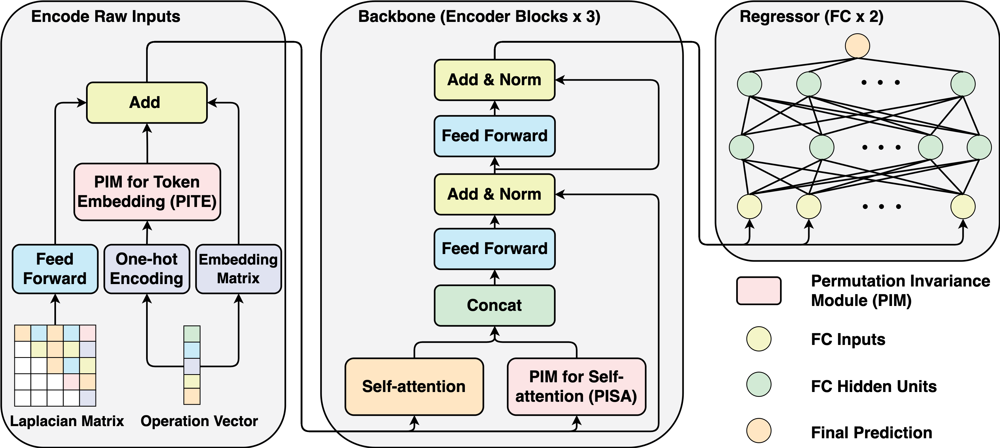

# PINAT: A Permutation INvariance Augmented Transformer for NAS Predictor (AAAI 2023)


This is the code for our paper "PINAT: A Permutation INvariance Augmented Transformer for NAS Predictor".
As AAAI does not publish the supplementary material, we provide this file in the folder of `assets`.



## Prerequisites and Dependencies
This repository contains the code of PINAT. 
To run the codes, please see the prerequisites below:
1. Download the datasets of NAS-Bench-101 and NAS-Bench-201, and pre-trained checkpoints from the [Google Drive](https://drive.google.com/drive/folders/1T_WlAwr1Cp-C3DEyclITyvUdqY3U8R_q?usp=share_link).
2. Install the necessary packages below via pip or conda. We used Anaconda Python 3.8 for our experiments.
```bash
dgl==0.6.1
h5py==3.7.0
matplotlib==3.6.2
networkx==2.8.7
opencv-python==4.6.0.66
pandas==1.5.1
Pillow==9.2.0
prettytable==3.4.1
pynvml==11.4.1
PyYAML==6.0
schema==0.7.5
scikit-learn==1.1.2
scipy==1.9.3
seaborn==0.12.1
tensorboard==2.10.1
tensorflow-gpu==2.10.0
torch==1.9.0
torch-cluster==1.6.0
torch-geometric==2.1.0.post1
torch-scatter==2.0.9
torch-sparse==0.6.12
torchvision==0.10.0
tqdm==4.64.1
```
* We also summarize our environments into the `requirements.txt`. To install a same environment, simply run:
```shell
pip install -r requirements.txt
```

## NAS-Bench Experiments
Go to the folder of `nasbench` and please refer to `nasbench/README.md`

## DARTS Experiments
Go to the folder of `darts` and please refer to `darts/README.md`

## Citation
If you find this work helpful in your research, please consider citing our paper:
```
@inproceedings{lu2023pinat,
  title     = {PINAT: A Permutation INvariance Augmented Transformer for NAS Predictor},
  author    = {Lu, Shun and Hu, Yu and Wang, Peihao and Tan, Jianchao and Li, Jixiang and Yang, Sen and Liu, Ji},
  booktitle = {Proceedings of the AAAI Conference on Artificial Intelligence (AAAI)},
  year      = {2023}
}
```
