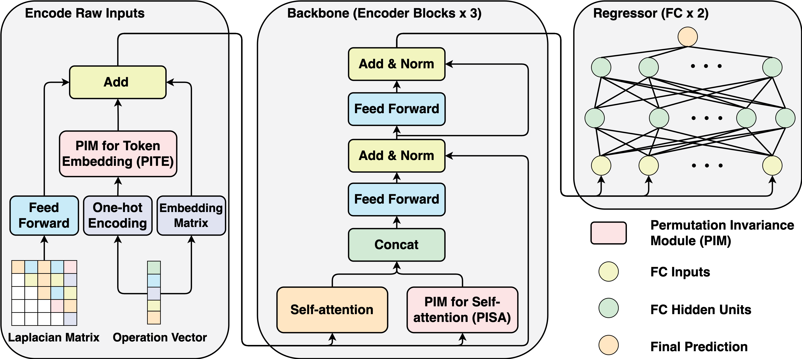

# PINAT: A Permutation INvariance Augmented Transformer for NAS Predictor (AAAI 2023)

This is an official pytorch implementation for "PINAT: A Permutation INvariance Augmented Transformer for NAS Predictor".

## Requirements
* Python 3.8.13
* PyTorch 1.9.0

## Usage
Our code is coming soon.