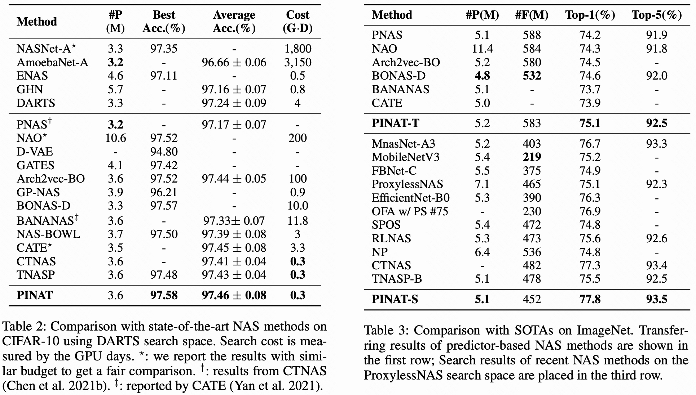

# DARTS Experiments of PINAT


## 1. Dataset Location
Place the CIFAR-10 and ImageNet dataset in the following location: 

CIFAR-10: `dataset/cifar10`

ImageNet: `dataset/imagenet`

## 2. Model Evaluation
Download the pre-trained weights from the `darts` folder of [Google Drive](https://drive.google.com/drive/folders/1T_WlAwr1Cp-C3DEyclITyvUdqY3U8R_q?usp=share_link) and place them in the `checkpoints/`.

To evaluate a pre-trained PINAT model on CIFAR-10, run:
```shell
python evaluate_cifar.py --arch pinat_c2 --dataset cifar10 --pretrained_ckpt ./checkpoints/pinat_c2_best_weights.pt
```
* These results are shown in the Table.2 of our paper.
* `arch` can be any one of `[pinat_c0, pinat_c1, pinat_c2]`


To evaluate the best pre-trained PINAT model on ImageNet, run:
```shell
python evaluate_imagenet.py --arch pinat_c2 --pretrained_ckpt ./checkpoints/c10_imagenet_transfer_best_model.pth
```
* This result is the performance of PINAT-T as shown in the Table.3 of our paper.


## 3. Model Retraining
To retrain a PINAT model on CIFAR-10, run:
```shell
python retrain_cifar.py  --arch pinat_c2 --dataset cifar10 --auxiliary --cutout
```

To retrain a PINAT model on ImageNet, run:
```shell
python -u retrain_imagenet.py --arch pinat_c2 --auxiliary
```

## Citation
If this project helps your research, please consider citing some of the following papers:
```
@inproceedings{liu2019darts,
  title={{DARTS}: Differentiable Architecture Search},
  author={Hanxiao Liu and Karen Simonyan and Yiming Yang},
  booktitle={International Conference on Learning Representations (ICLR)},
  year={2019},
}
@inproceedings{lu2023pinat,
  title     = {PINAT: A Permutation INvariance Augmented Transformer for NAS Predictor},
  author    = {Lu, Shun and Hu, Yu and Wang, Peihao and Han, Yan and Tan, Jianchao and Li, Jixiang and Yang, Sen and Liu, Ji},
  booktitle = {Proceedings of the AAAI Conference on Artificial Intelligence (AAAI)},
  year      = {2023}
}
```
