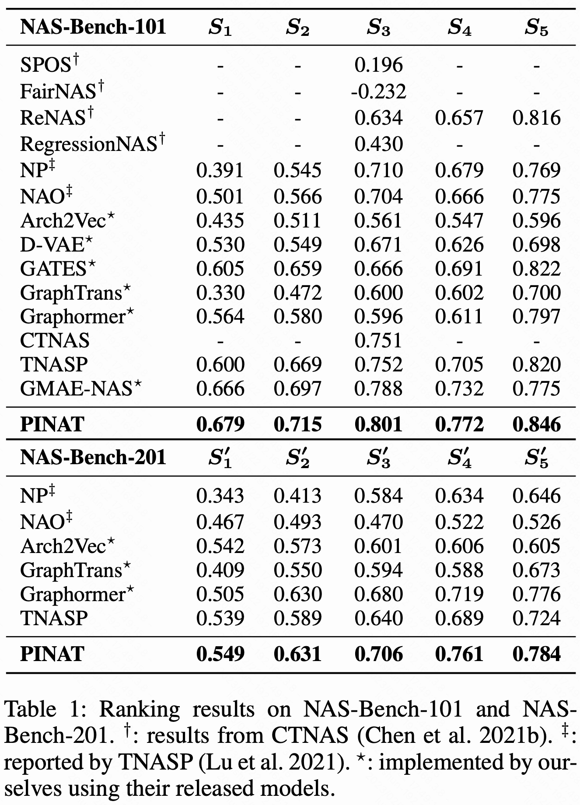

# NAS-Bench Experiments of PINAT
* Ranking results on NAS benchmarks are shown in the Table.1 of our paper.


## 1. NAS-Bench-101
Download the required data from [Google Drive](https://drive.google.com/drive/folders/1T_WlAwr1Cp-C3DEyclITyvUdqY3U8R_q?usp=share_link) and put it in: `nasbench/data/nasbench101`
* We get the compressed NAS-Bench-101 file `nasbench.hdf5` from [this repo](https://github.com/ultmaster/neuralpredictor.pytorch), using the script: `nasbench/datasets/tfrecord_converter.py`
* Once you get `nasbench.hdf5`, you can also randomly generate the training samples using the script: `nasbench/datasets/generate_splits.py`
* Code for generating the `laplacian_positional_encoding` is provided in: `nasbench/datasets/nb101_dataset.py`

To train the predictor PINAT using one data split on NAS-Bench-101, run:
```shell
python train_nasbench.py --exp_name pinat_101_100_all --bench 101 --train_split 100 --eval_split all
```
where:
* `exp_name` is used to record the experiment and can be set as you like
* `train_split` can be any one from `[100, 172, 424, 4236]` for NAS-Bench-101
* `eval_split` can be any one from `[100, all]` for NAS-Bench-101

To train the predictor PINAT using all data splits on NAS-Bench-101, run:
```shell
bash scripts/train_nasbench101.sh
```

## 2. NAS-Bench-201
Download the required data from [Google Drive](https://drive.google.com/drive/folders/1T_WlAwr1Cp-C3DEyclITyvUdqY3U8R_q?usp=share_link) and put it in: nasbench/data/nasbench201
* `nasbench201_dict.npy` is generated by using the code in: `nasbench/datasets/nb201_converter.py`

To train the predictor PINAT using one data split on NAS-Bench-201, run:
```shell
python train_nasbench.py --exp_name pinat_201_78_all --bench 201 --train_split 78 --eval_split all
```
where:
* `exp_name` is used to record the experiment and can be set as you like
* `train_split` can any one from `[78, 156, 469, 781, 1563]` for NAS-Bench-201
* `eval_split` can only be set to `all` for NAS-Bench-201

To train the predictor PINAT using all data splits on NAS-Bench-201, run:
```shell
bash scripts/train_nasbench201.sh
```

## Citation
If this project helps your research, please consider citing some of the following papers:
```
@inproceedings{ying2019bench,
  title={Nas-bench-101: Towards reproducible neural architecture search},
  author={Ying, Chris and Klein, Aaron and Christiansen, Eric and Real, Esteban and Murphy, Kevin and Hutter, Frank},
  booktitle={International Conference on Machine Learning (ICML)},
  year={2019},
}
@inproceedings{dong2020bench,
  title={NAS-Bench-201: Extending the Scope of Reproducible Neural Architecture Search},
  author={Xuanyi Dong and Yi Yang},
  booktitle={International Conference on Learning Representations (ICLR)},
  year={2020},
}
@inproceedings{lu2023pinat,
  title     = {PINAT: A Permutation INvariance Augmented Transformer for NAS Predictor},
  author    = {Lu, Shun and Hu, Yu and Wang, Peihao and Tan, Jianchao and Li, Jixiang and Yang, Sen and Liu, Ji},
  booktitle = {Proceedings of the AAAI Conference on Artificial Intelligence (AAAI)},
  year      = {2023}
}
```
